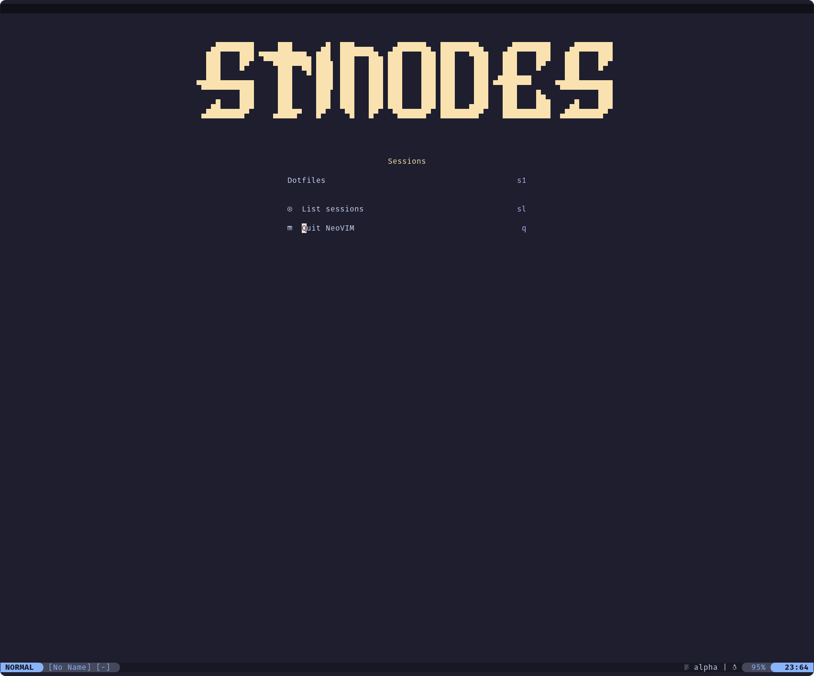
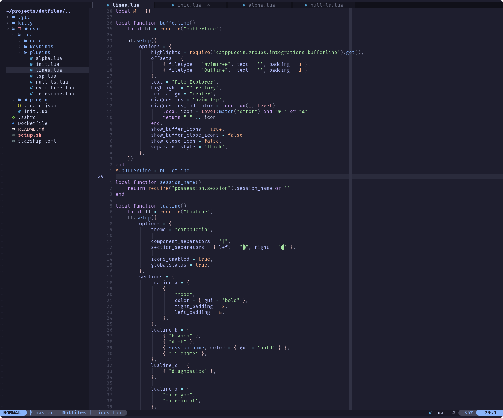
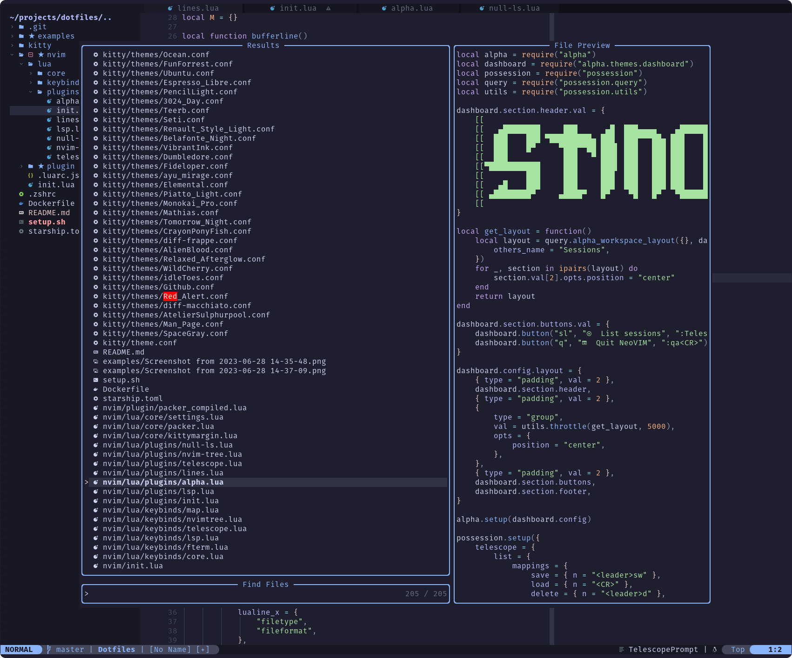
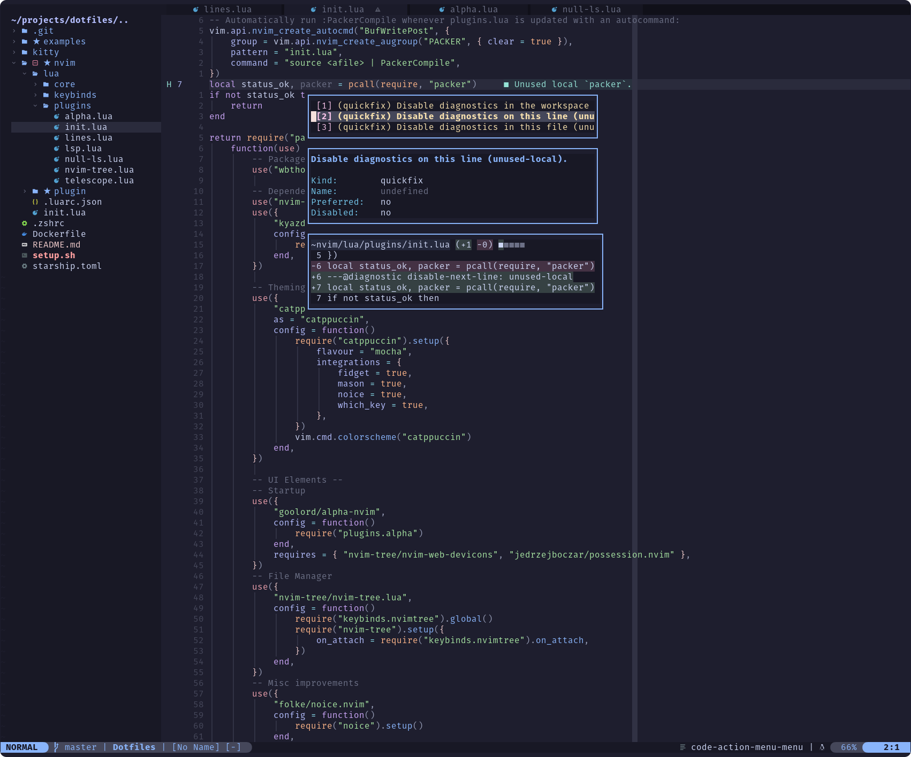

# Dotfiles

[- Setup](#setup)  
[- Examples](#examples)  
[- Plugins](#plugins)  
[- Customizations](#customizations)  
[- Keybinds](#Keybinds)

Set of dotfiles, making up my unified development suite, themed with Catppuccin.
**Included configs:**

- OMZ
- Starship
- NeoVim
- Kitty

## Setup

A setup script has been included, guiding you through the setup of a new system.  
Execute the script in a bash shell to be notified to install `zsh` instead.  
`source <script>` the script to run the installation process. After installing
OMZ, you might need to rerun the script.

Run `PackerInstall` in NeoVim after the linking process has completed.

**Note:** the following automatic install scripts might only work for Debian-based systems, as they use `apt`:

- Nvim
- Git

## Examples

Starter screen using alpha

General layout and look

Telescope as a finder and selector

Code actions with previews and diffs

## Plugins

**UI-elements**

- Alpha (starter screen)
- Nvim Tree (File tree)
- Noice (Command prompt)
- Telescope (Fuzzy finder and selector)
- Which Key (Keybind helper)
- FTerm (Floating terminal)
- Bufferline (Tabline for buffers)
- Lualine (Statusline)
- Fidget (Loading state)

**LSP**  
All language features are LSP-powered.

- LSP Zero (Easy lsp config base)
- Mason
- Nvim CMP (Completion)
  - Nvim CMP LSP (LSP as source)
  - CMD Luasnip (LuaSnip as source)
- LuaSnip (Snippets)
- Code Action Menu (Code actions)
- LSP File Operations
- Null-ls (Tooling layer to LSP)

**Code highlighting**

- Treesitter (Highlighting)
- Indent Blankline (Indent indicators)
- Colorizer (Hex/name color indicator)

**QoF/Misc**

- Comment (Block comment via shortcuts)
- Better escape (Escape via `jk`)

## Customizations

There are several (obviously) opinionated customizations implemented, outside of keybinds and plugin expectations.

- **`<leader>` is set to `<space>`!**
- Kitty margins are turned off when Nvim is running
- File references get updated after changing a file (LSP file operations + Nvim Tree)
- Lualine shows session name left of filename

## Keybinds

**Don't forget:** `which-key` will always help out displaying possible keybinds and keybind paths!

#### Core

| Binding       | Description              |
| ------------- | ------------------------ |
| **Buffers**   |                          |
| `<leader>w`   | Save buffer              |
| `<leader>W`   | Save buffers             |
| `<leader>d`   | Close buffer             |
| `<leader>D`   | Close all buffers        |
| `<leader>q`   | Close window             |
| `<leader>Q`   | Force close window       |
| `<leader>p`   | Paste without yank       |
| `<S-l>`       | Cycle to next buffer     |
| `<S-h>`       | Cycle to previous buffer |
| **Clipboard** |                          |
| `<leader>y`   | Yank & copy to clip      |
| `<leader>Y`   | Yank line & copy to clip |
| `<leader>Y`   | Yank line & copy to clip |
| `<C-j>`       | Move line up             |
| `<C-k>`       | Move line down           |
| **Misc**      |                          |
| `<C-/>`       | Comment selected block   |

#### LSP

| Binding             | Description                  |
| ------------------- | ---------------------------- |
| `<leader>ca`        | Open code actions            |
| `<leader>r`         | Rename symbol                |
| `K`                 | Hover documentation          |
| **Telescope lists** |                              |
| `<leader>gr`        | Symbol references            |
| `<leader>gd`        | Symbol definitions           |
| `<leader>gt`        | Symbol type definitions      |
| `<leader>gs`        | Show document/buffer symbols |
| `<leader>gw`        | Show workspace symbols       |
| `<leader>gT`        | Show treesitter definitions  |
| `<leader>gi`        | Symbol implementations       |

#### Nvim Tree

| Binding                 | Description              |
| ----------------------- | ------------------------ |
| `\`                     | Open/focus file tree     |
| `<C-e>`                 | Toggle file tree         |
| **While hovering node** |                          |
| `h`                     | Collapse node/folder     |
| `l`                     | Open folder or edit file |

#### Sessions

| Binding               | Description                 |
| --------------------- | --------------------------- |
| `<leader>sl`          | Show sessions in Telescope  |
| `<leader>sw`          | Enter name and save session |
| **In telescope list** |                             |
| `<leader>sw`          | Save session                |
| `<CR>`                | Open session                |
| `<leader>d`           | Delete session              |
| `<leader>r`           | Rename session              |

#### FTerm

| Binding       | Description                |
| ------------- | -------------------------- |
| `<leader>tt`  | Open floating terminal     |
| `<leader>ts`  | Execute scratch command    |
| `<leader>tdu` | Run `docker-compose up -d` |
| `<leader>tdd` | Run `docker-compose down`  |
