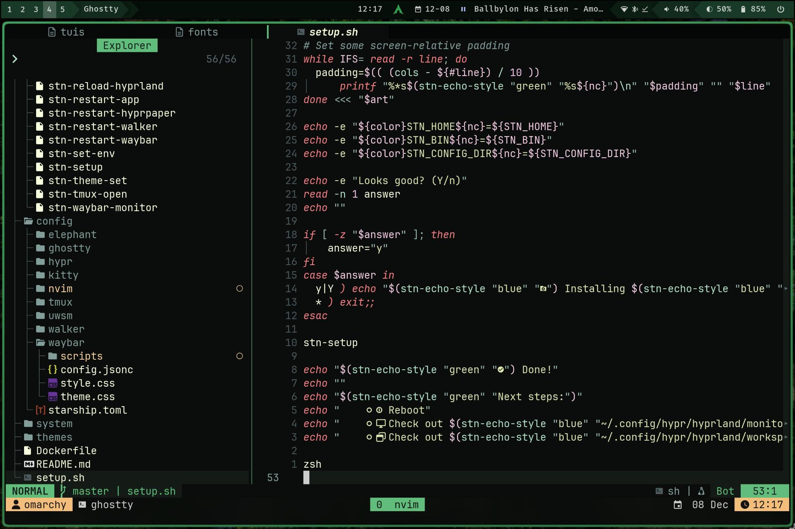
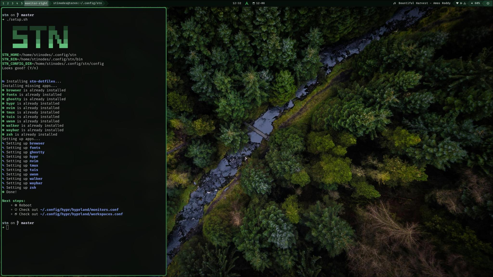
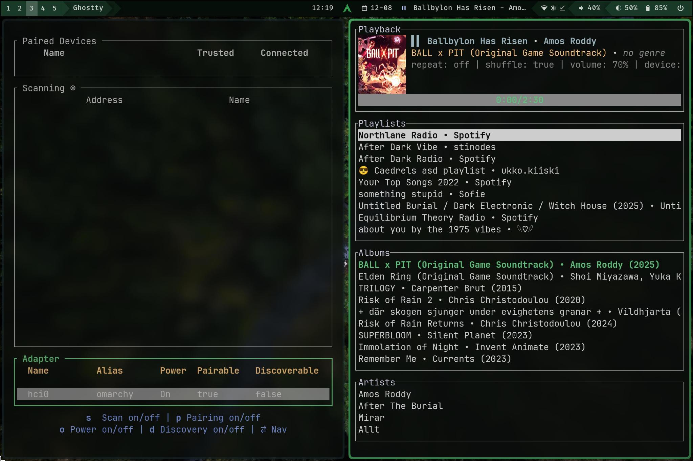

# Dotfiles



[**1) Setup**](#setup)  
[**2) Examples**](#examples)  
[**3) Plugins**](#plugins)  
[**4) Customizations**](#customizations)  
[**5) Keybinds**](#Keybinds)

**Included configs:**

- zsh/omz/starship
- neovim
- ghostty
- tuis
- walker
- hyprland
- waybar
- FiraCode
- uwsm
- tmux
- theming
- Includes several scripts

## Setup

Installing is done easily by cloning and running the setup script.

```bash
git clone https://github.com/stinodes/dotfiles.git ~/.config/stn
cd ~/.config/stn
./setup.sh
```

**Note:** To customize and distribute amongst your systems, fork the repo instead

**After rebooting:** check the `config/hypr/hyprland/monitors.conf` file to customize your monitor setup if needed.

<details>
<summary><h2>Examples</h2></summary>





</details>

## Keybinds

**General**  
key | action
--- | ---
`super + space` | Open app menu (`:` for clipboard, `>` for runner)
`super + q` | Quit app
`super + f` | Toggle fullscreen
`super + g` | Toggle floating
`super + v` | Toggle orientation

**Workspaces**  
key | action
--- | ---
`super + <y,u,i,o,p>` | Cycle main monitor workspaces
`super + m` | Move to game workspace (see windowrules)
`super + ctrl + <h,l>` | Focus monitor left/right (check `monitors.conf` & `workspaces.conf`)
`super + <h,j,k,l>` | Move window focus

**Note:** add `shift` as modifier to move the current window instead of changing focus

**nvim**  
See `which-key` and keybinds files for more info.

## Customizing

All the config files are located in the `config` folder.
To customize bindings:

- `config/hypr/hyprland/bindings.conf`
- `config/nvim/lua/keybinds/*`

For themes:

- `themes/`

To edit a theme, consider copying the folder, adjusting its name.  
Switch themes by calling `stn-theme-set <theme name>`.
